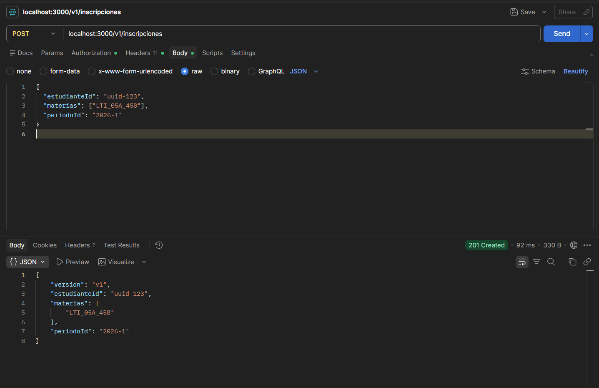
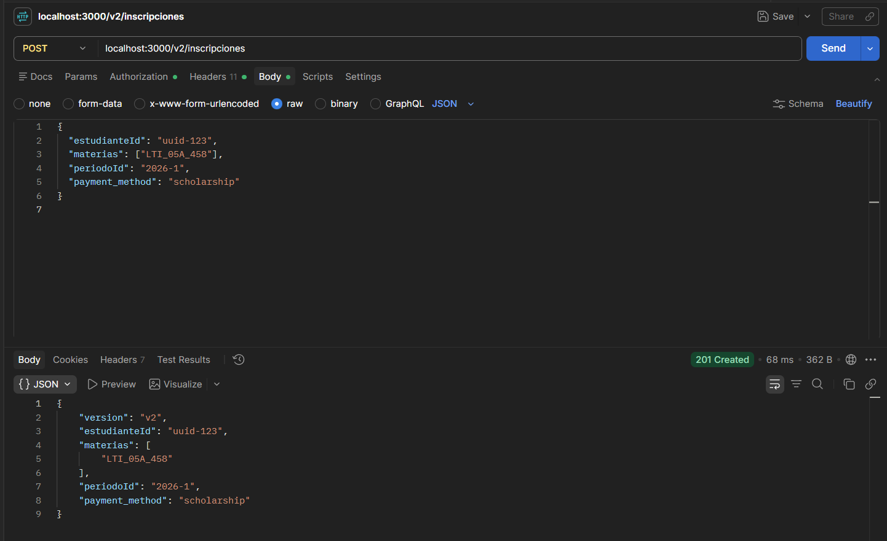
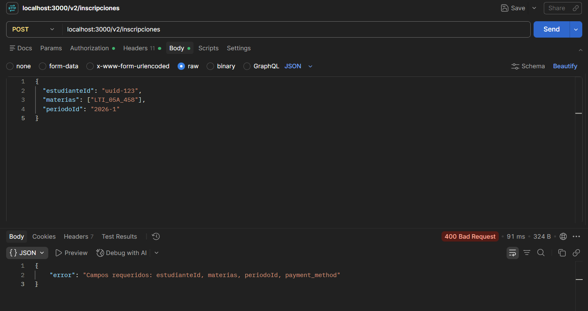
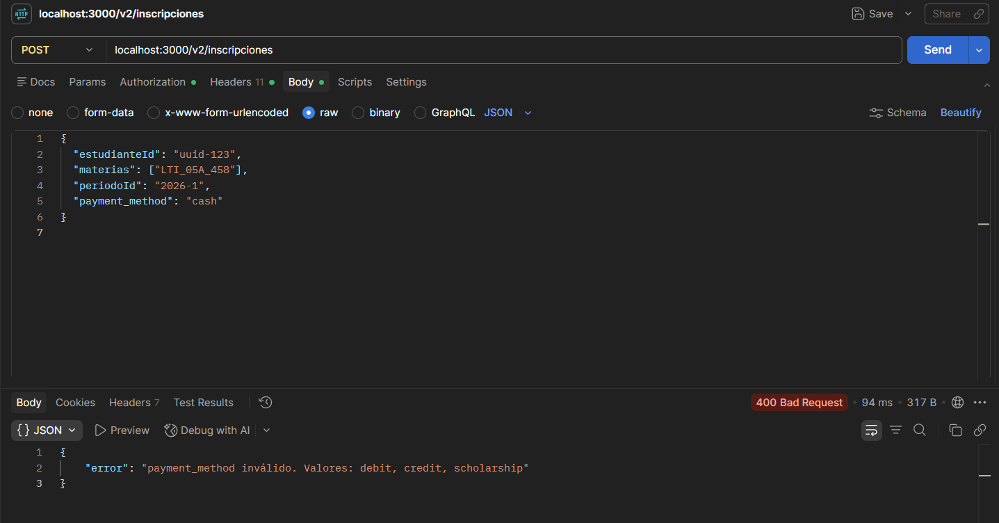

### Escenario 1:
### (a) Sin API key -> esperado: 401
### Comando:
### curl http://localhost:3000/health
### Salida:
### {"error":"API key inválida o ausente"}
### Explicacion:
### Significa que el backend sí estaba encendido en ese momento, pero faltó enviar la API key. Por eso da 401.

### Escenario 2:
### (b) Con clave válida -> esperado: 200
### Comando:
### curl -H "x-api-key: secreto-demo" http://localhost:3000/health
### Salida:
### curl: (7) Failed to connect to localhost port 3000 after 2250 ms: Could not connect to server
### Explicacion:
### Significa que el servidor ya no estaba corriendo o se apagó/crasheó. 
### Por eso no llega ni a validar la clave ni a revisar la ruta.

### Escenario 3:
### (c) Ruta inexistente -> esperado: 404
### Comando:
### curl -H "x-api-key: secreto-demo" http://localhost:3000/noexiste
### Salida:
### curl: (7) Failed to connect to localhost port 3000 after 2236 ms: Could not connect to server
### Explicacion:
### Significa que el servidor ya no estaba corriendo o se apagó/crasheó. 
### Por eso no llega ni a validar la clave ni a revisar la ruta.

## Testing

### Se implementaron pruebas unitarias utilizando Jest para validar los middlewares del proyecto.

### Ejecución de pruebas

### npm test

 ## Pruebas de los endpoints

Servidor corriendo en `http://localhost:3000`. Autenticacion: header `x-api-key: secreto-demo`.

### Escenario 1 — POST /v1/inscripciones con campos válidos (esperado: 201)

### Escenario 2 — POST /v2/inscripciones con payment_method válido (esperado: 201)

### Escenario 3 — POST /v2/inscripciones sin payment_method (esperado: 400)

### Escenario 4 — POST /v2/inscripciones con payment_method inválido (esperado: 400)

